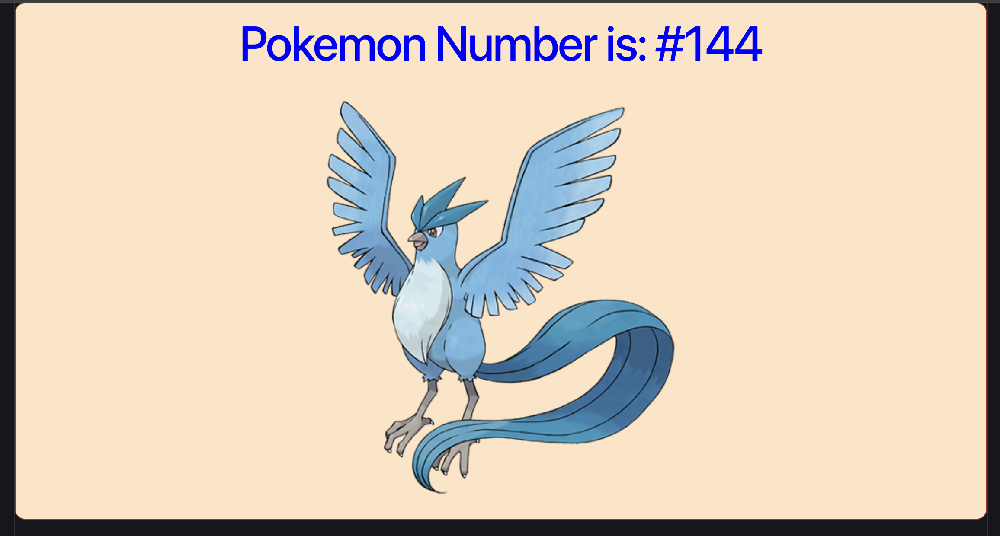

# Frontend Mentor - Random Pokemon App (React)

### Screenshot



## Table of contents

- [Overview](#overview)
  - [The challenge](#the-challenge)
  - [Links](#links)
- [My process](#my-process)
  - [Built with](#built-with)
  - [What I learned](#what-i-learned)
  - [Continued development](#continued-development)
  - [AI Collaboration](#ai-collaboration)
- [Author](#author)

---

## Overview

### The challenge

A simple React app that:

- Displays a random Pokemon on every page refresh
- Shows the Pokemon's number and official artwork image
- Styled with CSS using component-based class naming

### Links

- Solution URL: [GitHub](https://github.com/Ismail-SWE/random-pokemon)
- Live Site URL: (coming soon)

---

## My process

### Built with

- React 19 (with Vite)
- JSX (JavaScript XML)
- CSS (component-scoped styling)
- PokeAPI sprite CDN
- JavaScript Math functions

---

### What I learned

**1. What React is and why it exists**

React is a JavaScript library for building user interfaces using reusable components. It uses a declarative approach — you describe what the UI should look like, and React handles the DOM updates automatically.

**2. JSX — writing HTML inside JavaScript**

```jsx
function RandomPokemon() {
  return (
    <div className="RandomPokemon">
      <h1>Pokemon Number is: #2</h1>
    </div>
  );
}
```

JSX lets you write HTML-like syntax directly in JavaScript files.

**3. className instead of class**

Because `class` is a reserved keyword in JavaScript, React uses `className`:

```jsx
// ❌ HTML
<div class="RandomPokemon">

// ✅ JSX
<div className="RandomPokemon">
```

**4. Components — building blocks of UI**

Every piece of the UI is a component — a JavaScript function that returns JSX:

```jsx
function RandomPokemon() {
  return <div>Hello!</div>;
}
```

**5. Export and Import**

Components are exported from one file and imported into another:

```jsx
// RandomPokemon.jsx
export default RandomPokemon;

// App.jsx
import RandomPokemon from './RandomPokemon';
```

**6. JavaScript logic before return**

Variables and calculations go before the `return` statement:

```jsx
function RandomPokemon() {
  // JavaScript logic here
  let randNumber = Math.floor((Math.random() * 150) + 1);
  let pokemonImg = `https://raw.githubusercontent.com/PokeAPI/sprites/master/sprites/pokemon/other/official-artwork/${randNumber}.png`;

  // HTML (JSX) here
  return (
    <div className="RandomPokemon">
      <h1>Pokemon Number is: #{randNumber}</h1>
      
    </div>
  );
}
```

**7. Template literals for dynamic URLs**

Instead of string concatenation, template literals make dynamic URLs cleaner:

```js
// ❌ Old way
let url = "https://.../" + randNumber + ".png";

// ✅ Modern way
let url = `https://.../${randNumber}.png`;
```

**8. Curly braces {} in JSX**

Curly braces allow JavaScript expressions inside JSX:

```jsx
<h1>Pokemon Number is: #{randNumber}</h1>

```

**9. Double curly braces {{}} for inline styles**

```jsx
// Single {} = JS expression
// Inner {} = object
<div style={{ color: 'blue', fontSize: '20px' }}>Hello</div>
```

**10. Component-scoped CSS**

Each component has its own CSS file, named after the component:

```css
.RandomPokemon {
  border: 1px solid brown;
  width: 400px;
  border-radius: 12px;
  background-color: bisque;
  text-align: center;
}

.RandomPokemon h1 {
  color: blue;
}

.RandomPokemon img {
  width: 150px;
}
```

**11. Composing components**

Small components are combined inside a parent component:

```jsx
// App.jsx
function App() {
  return (
    <div>
      <RandomPokemon />
    </div>
  );
}
```

**12. Setting up React with Vite**

```bash
npm create vite@latest random-pokemon -- --template react
cd random-pokemon
npm install
npm run dev
```

Vite is faster than Create React App and is the modern way to start React projects.

---

### Continued development

- React Props — passing data between components
- React State — `useState` hook
- React Events — handling user interactions
- `useEffect` — fetching data from APIs
- React Router — multiple pages
- TypeScript with React

---

### AI Collaboration

- **Tool:** Claude (Anthropic)
- **How:** Used for understanding React concepts, debugging JSX errors, learning the difference between JS and JSX syntax, and setting up the Vite project
- **What worked well:** Getting instant explanations with code examples made it easy to understand why things work the way they do (e.g., why `className` instead of `class`, why `{{}}` for objects)
- **What didn't:** Some trial and error was still needed for CSS layout and file structure in Vite vs CRA

---

## Author

- Frontend Mentor - [@Ismail-SWE](https://www.frontendmentor.io/profile/Ismail-SWE)
- GitHub - [@Ismail-SWE](https://github.com/Ismail-SWE)